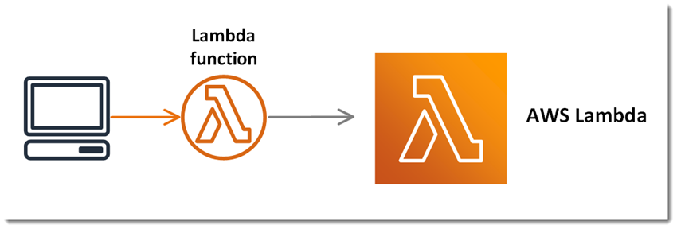
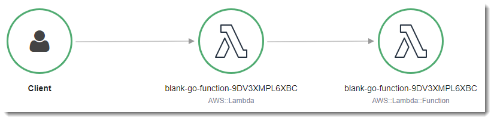
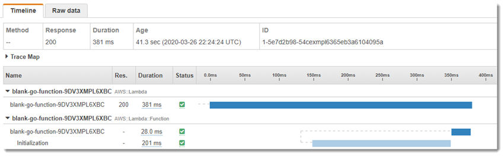

# Hello World function (Go)

The project source includes function code and supporting resources:

- `function` - A Golang function.
- `template.yml` - An AWS CloudFormation template that creates an application.
- `1-create-bucket.sh`, `2-deploy.sh`, etc. - Shell scripts that use the AWS CLI to deploy and manage the application.

Use the following instructions to deploy the sample application.

# Requirements

- [Go executable](https://golang.org/dl/)
- [The AWS CLI](https://docs.aws.amazon.com/cli/latest/userguide/cli-chap-install.html) v1.17 or newer.

# Setup

To create a new bucket for deployment artifacts, run `1-create-bucket.sh`.

    hello$ ./1-create-bucket.sh
    make_bucket: lambda-artifacts-a5e491dbb5b22e0d

# Deploy

To deploy the application, run `2-deploy.sh`.

    hello$ ./2-deploy.sh
    Successfully packaged artifacts and wrote output template to file out.yml.
    Waiting for changeset to be created..
    Successfully created/updated stack - hello-go

This script uses AWS CloudFormation to deploy the Lambda functions and an IAM role. If the AWS CloudFormation stack that contains the resources already exists, the script updates it with any changes to the template or function code.

# Test
To invoke the function, run `3-invoke.sh`.

    hello$ ./3-invoke.sh
    {
        "StatusCode": 200,
        "ExecutedVersion": "$LATEST"
    }
    "{\"FunctionCount\":42,\"TotalCodeSize\":361861771}"

Let the script invoke the function a few times and then press `CRTL+C` to exit.

The application uses AWS X-Ray to trace requests. Open the [X-Ray console](https://console.aws.amazon.com/xray/home#/service-map) to view the service map.

Choose a node in the main function graph. Then choose **View traces** to see a list of traces. Choose any trace to view a timeline that breaks down the work done by the function.

# Cleanup
To delete the application, run `4-cleanup.sh`.

    hello$ ./4-cleanup.sh
